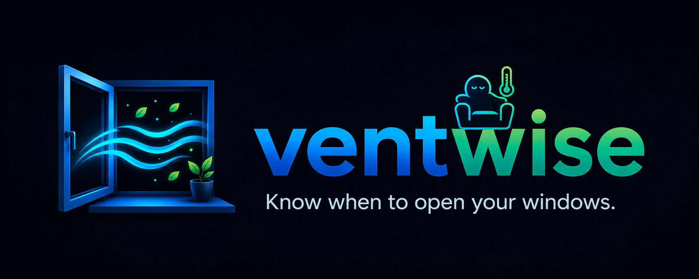

# VentWise

  

  
  
  
  

**A Home Assistant custom integration for comfort-based window recommendations.**

VentWise helps users decide when opening or closing windows is likely to improve indoor comfort. It evaluates temperature, humidity, wind, and the configured comfort target, then exposes a clear recommendation back to Home Assistant.

## At a glance

- Comfort-based recommendation engine
- Multi-room support
- Room management from the Home Assistant UI
- Summer and winter behavior
- Quiet hours and cooldowns
- Persisted runtime state across restarts
- HACS-ready packaging

## Why VentWise

- Reduce guesswork around when to open or close windows.
- Keep recommendations useful, quiet, and configurable from the Home Assistant UI.
- Support a clean HACS-first experience on both GitHub and Home Assistant.
- Make comfort rules understandable instead of hidden in automation logic.

## Installation

### Via HACS

<!-- Placeholder: add the final HACS install badge/button here once the packaging and release flow are finalized. -->

[Open VentWise in HACS](https://my.home-assistant.io/redirect/hacs_repository/?owner=AlexSantini10&repository=ventwise&category=integration)

Stable releases are published from `main` and remain the default latest version in HACS.
Experimental builds are published as GitHub prereleases from the `test` branch family.
To see those builds in HACS, enable prerelease updates for the repository.

### Manual install

<!-- Placeholder: add the final manual-install instructions or release artifact badge here. -->

Coming soon.

## Documentation

- [Project overview](docs/overview.md)
- [Domain model](docs/domain-model.md)
- [Scoring model](docs/scoring-model.md)
- [Home Assistant integration](docs/home-assistant-integration.md)
- [Testing](docs/testing.md)
- [Development workflow](docs/development.md)
- [HACS packaging](docs/hacs-packaging.md)
- [Contributing](CONTRIBUTING.md)

## TODO

- [ ] Improve HACS presentation and repository branding ([#16](https://github.com/AlexSantini10/ventwise/issues/16))
- [ ] Publish release automation and default catalog readiness ([#10](https://github.com/AlexSantini10/ventwise/issues/10))

## Project structure

- `docs/`: development and design documentation
- `src/`: reusable Python comfort engine
- `custom_components/ventwise/`: Home Assistant custom integration
- `tests/`: scoring and behavior tests
- `brand/`: repo banner and icon assets

## Development

- Install the project in editable mode with the `dev` extra.
- Run `pytest` for the local test suite.
- Use `python ha-local-docker-test.py` for a local Home Assistant sandbox that
  mounts the checked-out integration directly from the repo.
- Keep repository hygiene rules in `.gitignore`.
- Keep the backlog in GitHub issues rather than duplicating it in the repo.
- CI validates HACS and Hassfest before releases.
- Release workflows publish an installable Home Assistant zip artifact.

## License

Apache License 2.0. See [LICENSE](LICENSE) and [NOTICE](docs/NOTICE.md).
