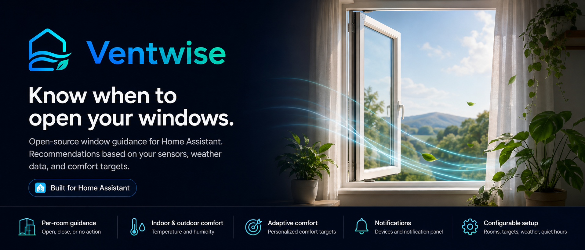

# VentWise

  

  
  
  
  

**A Home Assistant custom integration for weather-aware window ventilation and
indoor-comfort recommendations.**

VentWise helps users decide when opening or closing windows is likely to improve indoor comfort. It evaluates a standard weather source, optional outdoor temperature, humidity, and wind overrides, and the configured comfort target, then exposes a clear recommendation back to Home Assistant.

> [!WARNING]
> **Beta software — use recommendations with care.** VentWise has automated CI
> coverage and limited real-world use, but it has not been exhaustively tested
> across all homes, sensors, weather conditions, or hardware. It provides
> informational recommendations only; it is not a safety, security, weather-
> protection, or automation-control system. Always assess the actual conditions
> before opening or closing anything, and do not rely on VentWise to prevent
> injury, property damage, intrusion, rain exposure, or equipment damage. See
> the full [license, disclaimer, and reporting guidance](docs/NOTICE.md).

## At a glance

- Comfort-based recommendation engine
- Multi-room support
- Room management from the Home Assistant UI
- Summer and winter behavior
- Quiet hours and cooldowns
- Persisted runtime state across restarts
- HACS-ready packaging

## Why VentWise

- Reduce guesswork around when to open or close windows.
- Keep recommendations useful, quiet, and configurable from the Home Assistant UI.
- Support a clean HACS-first experience on both GitHub and Home Assistant.
- Make comfort rules understandable instead of hidden in automation logic.

## Installation

### Via HACS

The button opens VentWise in HACS as a **custom repository**. It works before
VentWise is listed in the public HACS catalogue; HACS must already be installed
and will ask the user to confirm the download. Select **Download**, restart
Home Assistant when prompted, then add **VentWise** from **Settings > Devices
& services > Add integration**.

Stable releases are published from `main`. Experimental prereleases from the
`test` branch family are for testing only.

### Manual install

Download `ventwise.zip` from the latest GitHub release, extract it into
`<Home Assistant configuration>/custom_components/ventwise/`, and restart
Home Assistant. The complete steps, including update and removal instructions,
are in the [user guide](docs/user-guide.md#manual-installation).

### First setup

After installation, open **Settings > Devices & services > Add integration**
and select **VentWise**. Choose a Home Assistant weather entity, set your
comfort values, optionally choose notification devices, and add a room with
its indoor temperature and humidity sensors. See the
[first setup guide](docs/user-guide.md#first-setup).

## Documentation

### For users

- [Install, configure, update, and remove VentWise](docs/user-guide.md)
- [Collect safe diagnostic logs and report a problem](docs/user-guide.md#get-help-or-report-a-problem)
- [How the Home Assistant integration works](docs/home-assistant-integration.md)
- [Safety, beta status, and reporting guidance](docs/NOTICE.md)

### For contributors

- [Contributing guide](CONTRIBUTING.md)
- [Documentation index](docs/INDEX.md)
- [Development workflow](docs/development.md)
- [Testing](docs/testing.md)
- [Scoring model](docs/scoring-model.md)
- [HACS packaging and discoverability](docs/hacs-packaging.md)

## Project structure

- `docs/`: development and design documentation
- `custom_components/ventwise/ventwise_core/`: reusable Python comfort engine
- `custom_components/ventwise/`: Home Assistant custom integration
- `tests/`: scoring and behavior tests
- `docs/assets/brand/`: repository banner and marketing assets
- `custom_components/ventwise/brand/`: Home Assistant runtime brand assets

## Development

- Install the project in editable mode with the `dev` extra.
- Run `pytest` for the local test suite.
- Use `python ha-local-docker-test.py` for a local Home Assistant sandbox that
  mounts the checked-out integration directly from the repo.
- Keep repository hygiene rules in `.gitignore`.
- Keep the backlog in GitHub issues rather than duplicating it in the repo.
- CI validates HACS and Hassfest before releases.
- Release workflows publish an installable Home Assistant zip artifact.

## License

Apache License 2.0. See [LICENSE](LICENSE) and [NOTICE](docs/NOTICE.md).
